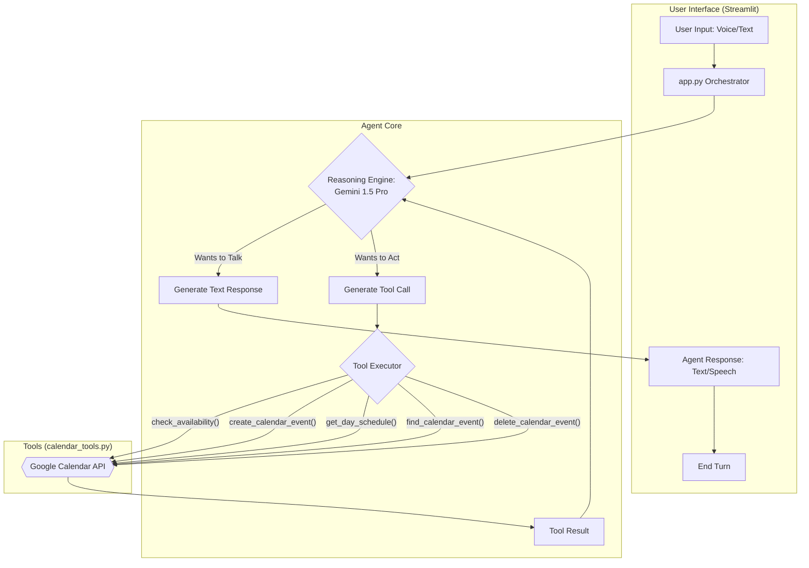

# Smart Scheduler AI Agent

This project is a sophisticated, voice-enabled AI agent built for the NextDimension take-home assignment. It functions as a perceptive personal assistant that can understand user needs, check a Google Calendar for availability, and manage events through a multi-turn, stateful conversation. The agent is deployed as an interactive web application using Streamlit.

---

## 🚀 Features

*   **🗣️ Hybrid Conversational UI:** Interact via both voice commands and text input. The agent responds with synthesized speech and text.
*   **🗓️ Full Calendar Management:**
    *   **Create Events:** Schedule new meetings and appointments.
    *   **Read Schedule:** Ask "What's my schedule for tomorrow?" to get a summary of your day.
    *   **Delete Events:** Directly ask to delete events (e.g., "delete my 5pm meeting").
*   **🧠 High Emotional Intelligence:** The agent detects the context of the event (e.g., a professional meeting vs. a personal date) and adapts its tone and suggestions accordingly.
*   **💡 Proactive Suggestions:** For personal events, the agent can suggest adding buffer time before the event or setting reminders.
*   **🔄 Multi-Turn Context:** The agent remembers the entire conversation, allowing users to change topics, correct themselves, and have a natural, flowing dialogue.
*   **🛠️ Transparent Tool Use:** The UI includes a "View Tool Details" expander to show exactly which functions the AI is calling and with what arguments, providing insight into its reasoning process.

---

## 🏗️ Architecture & Orchestration

The agent's architecture is designed to separate its "brain" from its "hands," allowing for a modular and robust system.

⚙️ Setup and Installation
Follow these steps to set up and run the project on your local machine.
1. Prerequisites
Python 3.10+
Git
2. Clone the Repository
Open your terminal and run the following command:
->git clone https://github.com/CreatorGeetansh/smart_scheduler_AI
->cd smart_scheduler_AI
Use code with caution.
Bash
3. Google Cloud & AI Studio Setup
This is the most critical part of the setup. You must configure Google's services to get the necessary credentials.
a) Google Cloud Console (For Calendar API)
Enable API: Go to the Google Cloud Console, create a new project, and enable the Google Calendar API.
Configure Consent Screen:
Navigate to APIs & Services > OAuth consent screen.
Choose External user type.
Fill in the required app name and user emails.
Crucially, under "Publishing status", click [PUBLISH APP] and confirm. The status must be "In production" to allow any Google account to log in.
Create Credentials:
Navigate to APIs & Services > Credentials.
Click [+ CREATE CREDENTIALS] and select OAuth client ID.
For Application type, you MUST select Desktop app. This is essential for the local authentication flow to work.
After creation, click [DOWNLOAD JSON].
Rename the downloaded file to credentials.json and place it in the root of your project folder.
b) Google AI Studio (For Gemini API)
Go to Google AI Studio.
Click "Get API key" and then "Create API key".
Copy this key.
4. Environment Setup
Create the .env file: In the root of the project folder, create a file named .env and add your Gemini API key to it:
GEMINI_API_KEY="YOUR_GEMINI_API_KEY_HERE"
Use code with caution.
Create a Virtual Environment:
python -m venv venv
Use code with caution.
Bash
On Windows: venv\Scripts\activate
On macOS/Linux: source venv/bin/activate
Install Dependencies: Install all required Python packages.
pip install -r requirements.txt
Use code with caution.
Bash
5. Running the Application
Ensure your virtual environment is activated.
Run the Streamlit app from your terminal:
streamlit run app.py
Use code with caution.
Bash
Your web browser will open with the application.
First-Time Authentication:
The app will show a warning and an [Authenticate with Google Calendar] button. Click it.
A new browser tab will open for the Google login flow. Choose your account.
You may see a "Google hasn’t verified this app" screen. Click "Advanced", then "Go to [Your App Name] (unsafe)".
Click "Allow" to grant the necessary calendar permissions.
The login tab will close, and a token.json file will be created in your project folder. The Streamlit app will reload, now fully authenticated and ready to use.

